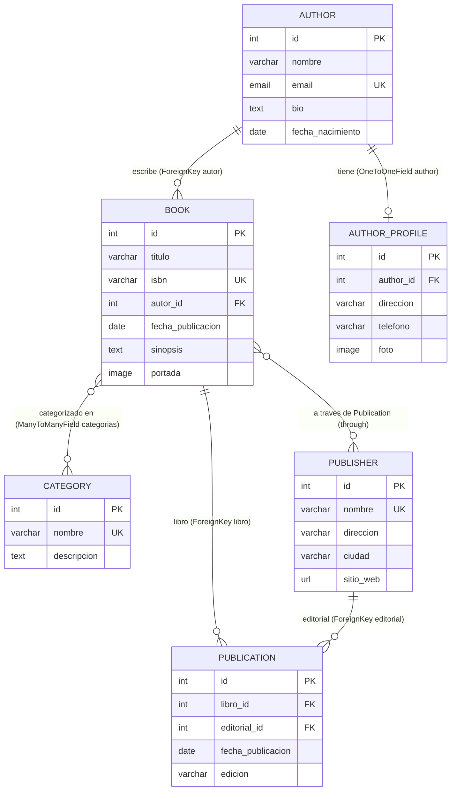

# Diagrama de Modelos — Laboratorio 4 (Semana 4)

Diagrama ER del proyecto Django `library` basado en los modelos reales de `library/models.py`.

## Diagrama

## Observaciones del modelo

- **Book–Author usa `ForeignKey`**: un autor puede escribir **muchos** libros y cada libro pertenece a **un** autor. La cardinalidad es 1:N y la relación se guarda en `Book.autor = models.ForeignKey(Author, on_delete=CASCADE, related_name='books')`. El campo vive en el lado "muchos" (`Book`).
- **Author–AuthorProfile usa `OneToOneField`**: cada autor tiene **un único** perfil y cada perfil pertenece a **un único** autor (cardinalidad 1:1). Sirve para separar los datos biográficos del registro principal: `AuthorProfile.author = models.OneToOneField(Author, on_delete=CASCADE, related_name='profile')`.
- **Book–Category usa `ManyToManyField`**: un libro puede pertenecer a **muchas** categorías y una categoría puede contener **muchos** libros (cardinalidad N:M). Django crea automáticamente la tabla intermedia: `Book.categorias = models.ManyToManyField(Category, related_name='books')`.
- **Book–Publisher necesita `Publication`**: la relación entre un libro y su editorial sería N:M, pero además se quiere **guardar datos propios de esa relación**: la fecha de publicación específica (`fecha_publicacion`) y la edición (`edicion`). Con un simple `ManyToManyField` no hay lugar para esos datos, por eso se usa el modelo intermedio `Publication` con `through='Publication'` y `through_fields=('libro', 'editorial')`.
- **Información adicional en `Publication`**: además de los enlaces `libro` (FK hacia Book) y `editorial` (FK hacia Publisher), almacena `fecha_publicacion` (DateField) y `edicion` (CharField). La combinación `(libro, editorial)` es única (`unique_together`), evitando publicaciones duplicadas del mismo libro con la misma editorial.
- **Comportamiento de `CASCADE`**: al eliminar el objeto padre se eliminan automáticamente los relacionados. Se usa en `Book.autor`, `AuthorProfile.author` y `Publication.libro` (al borrar un autor se borran sus libros y su perfil).
- **Comportamiento de `PROTECT`**: impide eliminar el objeto padre mientras existan relacionados y lanza `ProtectedError`. Se usa en `Publication.editorial` (no se puede borrar una editorial que tenga publicaciones).