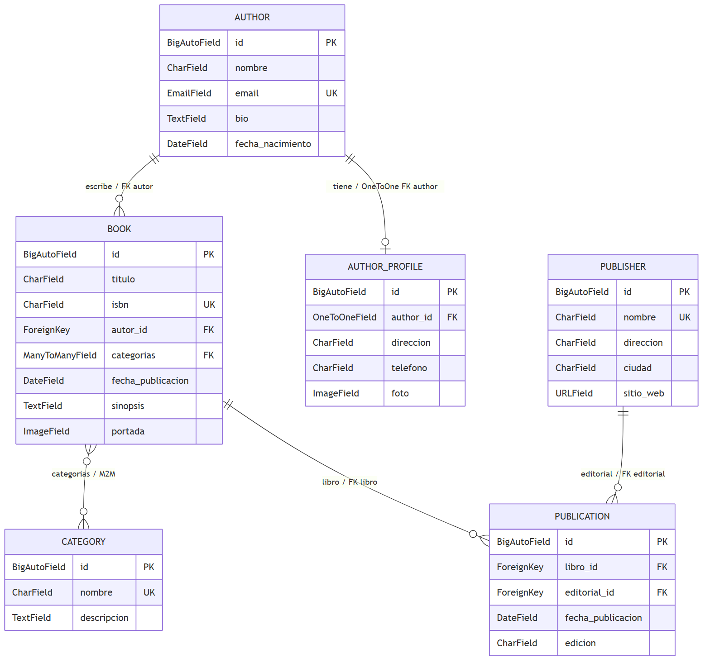
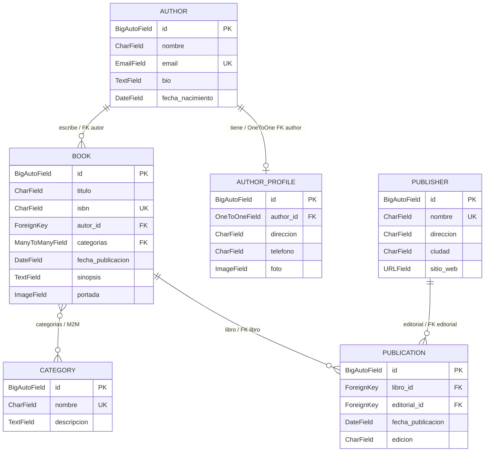

# Modelo relacional — Laboratorio 4

Imagen generada a partir del diagrama fuente con **Mermaid CLI** (`@mermaid-js/mermaid-cli`). También está disponible la versión vectorial: [modelo-relacional.svg](modelo-relacional.svg).

## Fuente del diagrama (Mermaid)

Archivo fuente editable: [modelo-relacional.mmd](modelo-relacional.mmd).

## Relaciones

### Author – Book (1:N)

`Book.autor = ForeignKey(Author, on_delete=CASCADE, related_name='books')`. Un autor escribe **N** libros; cada libro pertenece a **1** autor. La clave foránea vive en `Book`.

### Author – AuthorProfile (1:1)

`AuthorProfile.author = OneToOneField(Author, on_delete=CASCADE, related_name='profile')`. Cada autor tiene **1** perfil y cada perfil pertenece a **1** autor.

### Book – Category (N:M)

`Book.categorias = ManyToManyField(Category, related_name='books')`. Un libro pertenece a **M** categorías y una categoría agrupa **N** libros. Django crea la tabla intermedia automáticamente (no se declara un modelo manual).

### Book – Publication – Publisher (1:N – N:1)

`Book.editorial = ManyToManyField(Publisher, through='Publication', through_fields=('libro', 'editorial'))`. El modelo **Publication** es el intermedio: un libro tiene **N** publicaciones y una editorial tiene **N** publicaciones. No existe relación directa Book–Publisher: siempre pasa por `Publication`.

## Observaciones

- `Publication` almacena datos propios de la relación libro–editorial: `fecha_publicacion` (DateField) y `edicion` (CharField), además de las claves `libro_id` y `editorial_id`.
- `Publication` declara `unique_together = ('libro', 'editorial')` para evitar que un libro tenga dos publicaciones con la misma editorial.
- `on_delete=models.CASCADE`: al borrar un autor se borran sus libros (`Book.autor`) y su perfil (`AuthorProfile.author`); al borrar un libro se borran sus publicaciones (`Publication.libro`).
- `on_delete=models.PROTECT`: no se puede borrar una editorial que tenga publicaciones (`Publication.editorial`), se lanza `ProtectedError`.
- La relación `Book ↔ Category` es Many-to-Many directa; Django genera su tabla intermedia automáticamente.